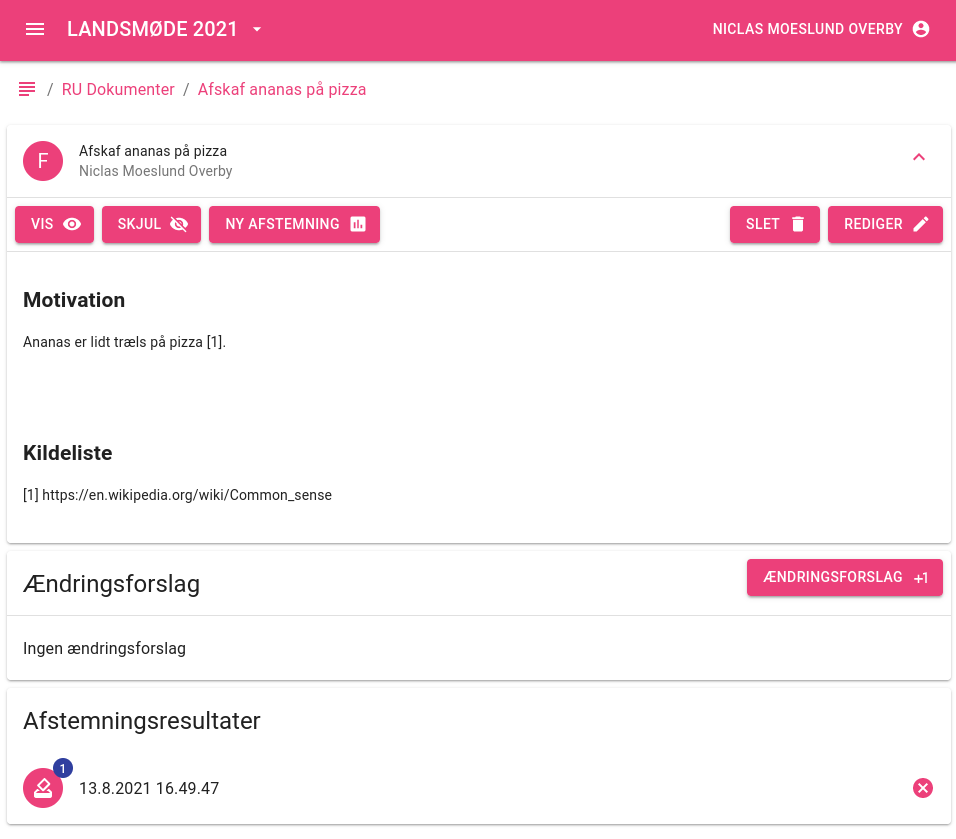
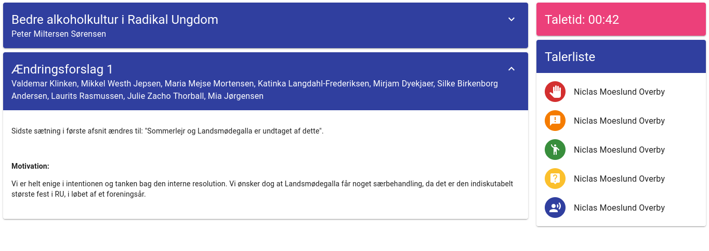

# RadikalWiki
A full open source solution for voting, organizing conference communication and managing political documents.

Built with [Next.js](https://nextjs.org), [Hasura](https://hasura.io) and [NHost](https://nhost.io).

## Showcase

